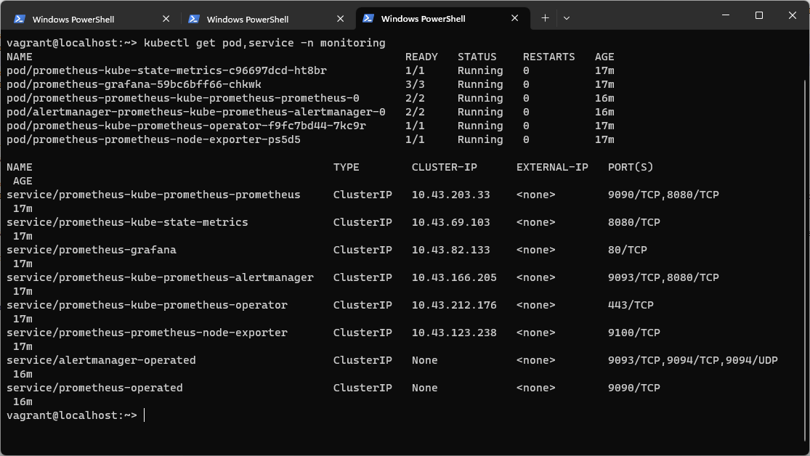
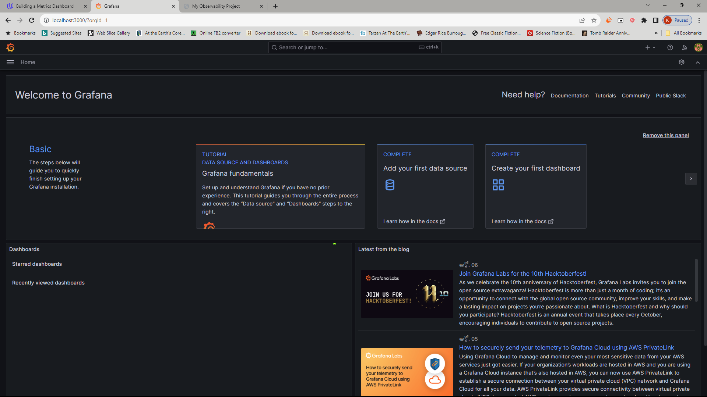
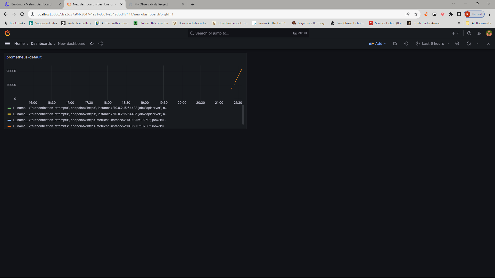
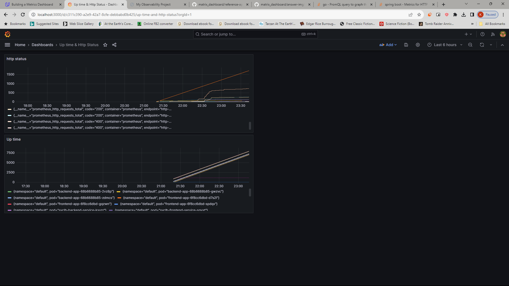
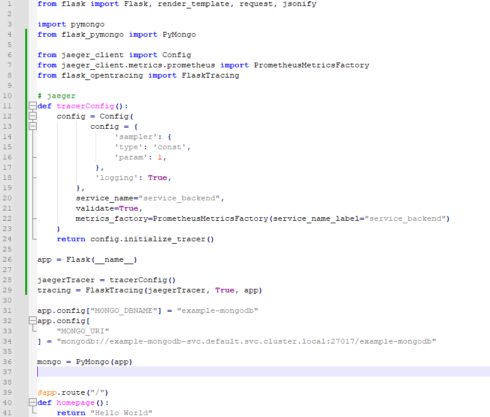

## Verify the monitoring installation

## Setup the Jaeger and Prometheus source

## Create a Basic Dashboard

## Describe SLO/SLI

 - The up time of the portal for June was 99.99%
 - The down time of the portal for March was 0.03%
 - The average latency for the 2nd quarter this year was 300 milliseconds
 - The peak latency for September this year was 400 milliseconds

## Creating SLI metrics.

 - We can create an Events timeline overtime listing states of the portal like down, maintenance, suspended e.g. to visualize the up time
 - We can create an Availability percentage trend to realize availability over a time span
 - We can create a downtime history table to list down times over a time span
 - We can create an Average response time [per hour for e.g.] metric to visualize the response time over a time period of several days or a month
 - We can create a Peak response time [per hour for e.g.] metric to visualize the response time over a time period of several days or a month

## Create a Dashboard to measure our SLIs

## Tracing our Flask App

## Jaeger in Dashboards
*TODO:* Now that the trace is running, let's add the metric to our current Grafana dashboard. Once this is completed, provide a screenshot of it here.

## Report Error
*TODO:* Using the template below, write a trouble ticket for the developers, to explain the errors that you are seeing (400, 500, latency) and to let them know the file that is causing the issue also include a screenshot of the tracer span to demonstrate how we can user a tracer to locate errors easily.

TROUBLE TICKET

Name:

Date:

Subject:

Affected Area:

Severity:

Description:

## Creating SLIs and SLOs

 - Create a metric for 40x/50x error rate 
 - Create a metric for number of user requests returning 200
 - Create a metric for maintenance window in hours per weekend
 - Create a metric for number of db request failures per week

## Building KPIs for our plan

 - 40x/50x error rate is less than 5 per 10000 reqeusts
 - Number of user requests returning 200 shall be atleast 498 out of 500 requests
 - Maintenance hours per weekend shall be less than 2
 - Db request failures per week shall be 500 out of 10000

## Final Dashboard
*TODO*: Create a Dashboard containing graphs that capture all the metrics of your KPIs and adequately representing your SLIs and SLOs. Include a screenshot of the dashboard here, and write a text description of what graphs are represented in the dashboard.  
