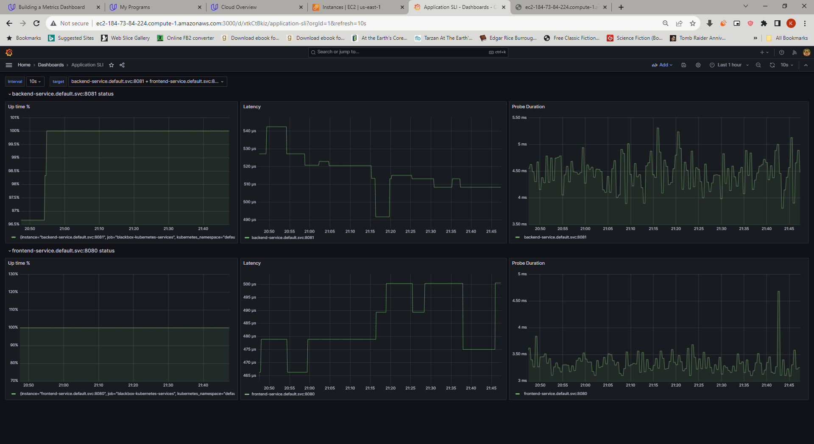

## Verify the monitoring installation

## Setup the Jaeger and Prometheus source

## Create a Basic Dashboard

## Describe SLO/SLI

 - The up time of the portal for June was 99.99%
 - The down time of the portal for March was 0.03%
 - The average latency for the 2nd quarter this year was 300 milliseconds
 - The peak latency for September this year was 400 milliseconds

## Creating SLI metrics.

 - We can create an Events timeline overtime listing states of the portal like down, maintenance, suspended e.g. to visualize the up time
 - We can create an Availability percentage trend to realize availability over a time span
 - We can create a downtime history table to list down times over a time span
 - We can create an Average response time [per hour for e.g.] metric to visualize the response time over a time period of several days or a month
 - We can create a Peak response time [per hour for e.g.] metric to visualize the response time over a time period of several days or a month

## Create a Dashboard to measure our SLIs

## Tracing our Flask App

## Jaeger in Dashboards

## Report Error

TROUBLE TICKET

Name: Kishore 

Date: 8 OCT 2023

Subject: Recent 400 errors faced by customers while using udagram app

Affected Area: Image retrieval from Vendor Storage Portal

Severity: High

Description: 

- Customers weren't able to view images during last weekend. 
- Upon analyzing the traces, we were able to find the root cause for these 400 errors. 
 - Vendor Storage Portal 
wasn't returning the images requested and these seems to be a problem with few records. 
 - You can find the Trace span below where we were able to track down the issue to a back end service which talks to Vendor site in the findtestrecord end point. 
 - As a corrective action, we have shared the failed image ids with the Vendor and the issue will be resolved in 2-3 days.

## Creating SLIs and SLOs

For SLO guaranteeing that our application has a 99.95% uptime per month

 - Measure the rate of user requests returning 200 
 - Measure the 40x/50x error rate 
 - Measure the latency of requests over time
 - Measure the average time between failures
 

## Building KPIs for our plan

 - Percentage of user requests returning 200 shall be 99.95 % over a day
 - Quantile (0.95) of time to first byte for each request shall be under a milli second over a day
 - Probe duration of the front and back end server shall be less than 10 ms over the span of a day

## Final Dashboard

As mentioned in the KPIs, panels have been created to track the metrics using prometheus grafana stack for both front end and back end servers of our application

- Up time panel to monitor percentage of user requests returning 200
- Latency panel to monitor latency of each request i.e. time to first byte metric
- Probe duration panel for monitoring the probe latency

